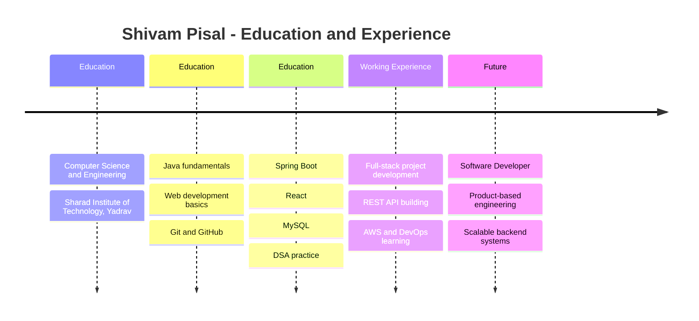

<!-- GitHub Profile README for Shivam Pisal | Repository: ShivamPisal -->

<p align="center">
  
</p>

<h1 align="center">Hi, I'm Shivam Pisal</h1>

<p align="center">
  
</p>

<p align="center">
  <a href="https://www.linkedin.com/in/shivam-pisal/"></a>
  <a href="mailto:shivampisal.866@gmail.com"></a>
  <a href="https://github.com/ShivamPisal"></a>
  <a href="https://leetcode.com/shivampisal00/"></a>
  <a href="https://www.instagram.com/shivampisal00/"></a>
</p>

<p align="center">
  
  
  
</p>

---

## About Me

- Computer Science and Engineering student at **Sharad Institute of Technology, Yadrav**
- Learning and building with **Java, Spring Boot, React, MySQL, REST APIs, and AWS**
- Interested in clean backend architecture, practical full-stack apps, and problem solving
- Improving **DSA**, API design, deployment workflows, and system design fundamentals
- Career goal: become a strong software developer in a product-based engineering team

---

## Tech Stack

<p align="center">
  
</p>

<table>
  <tr>
    <td><strong>Backend</strong></td>
    <td>Java, Spring Boot, REST APIs, Spring Security, JDBC/JPA basics</td>
  </tr>
  <tr>
    <td><strong>Frontend</strong></td>
    <td>React, JavaScript, HTML5, CSS3, responsive UI</td>
  </tr>
  <tr>
    <td><strong>Database</strong></td>
    <td>MySQL, schema design, SQL queries</td>
  </tr>
  <tr>
    <td><strong>Cloud & DevOps</strong></td>
    <td>AWS basics, Docker fundamentals, GitHub Actions, CI/CD</td>
  </tr>
  <tr>
    <td><strong>Tools</strong></td>
    <td>Git, GitHub, VS Code, IntelliJ IDEA, Postman, Linux basics</td>
  </tr>
</table>

---

## Cloud & DevOps

<p align="center">
  
  
  
  
  
  
</p>

```yaml
focus:
  backend: Java, Spring Boot, REST APIs, MySQL
  cloud: AWS EC2, S3, IAM, deployment basics
  devops: GitHub Actions, Docker fundamentals, CI/CD
  practice: DSA, API testing, system design fundamentals
```

---

## GitHub Analytics

<p align="center">
  
</p>

<p align="center">
  
  
  
</p>

<p align="center">
  
</p>

<p align="center">
  
</p>

---

## LeetCode Activity

<p align="center">
  <a href="https://leetcode.com/shivampisal00/">
    
  </a>
</p>

<p align="center">
  
</p>

---

## Current Learning

<table>
  <tr>
    <td width="33%"><strong>Backend</strong><br />Spring Boot, API security, JPA, testing</td>
    <td width="33%"><strong>Frontend</strong><br />React patterns, clean UI, reusable components</td>
    <td width="33%"><strong>DSA</strong><br />Arrays, strings, trees, graphs, dynamic programming</td>
  </tr>
  <tr>
    <td width="33%"><strong>Cloud</strong><br />AWS EC2, S3, IAM, deployment workflows</td>
    <td width="33%"><strong>DevOps</strong><br />GitHub Actions, Docker, CI/CD basics</td>
    <td width="33%"><strong>System Design</strong><br />Scalable APIs, caching, database design</td>
  </tr>
</table>

---

## 2026 Goals

- Build and publish **5+ production-quality full-stack projects**
- Solve **400+ DSA problems** with strong revision notes
- Learn **AWS deployment and CI/CD** through real project hosting
- Contribute to open-source projects and improve collaboration skills
- Prepare for software developer roles at strong product-based companies

---

## Career Timeline



<!--
  To add exact work experience, replace the Working Experience line above with:
  Working Experience : Company Name : Role Name : Java/Spring Boot/React responsibilities
-->

---

## Contribution Snake

<!-- Generated by .github/workflows/snake.yml after GitHub Actions runs. -->

<p align="center">
  <picture>
    <source media="(prefers-color-scheme: dark)" srcset="https://raw.githubusercontent.com/ShivamPisal/ShivamPisal/output/github-snake-dark.svg" />
    <source media="(prefers-color-scheme: light)" srcset="https://raw.githubusercontent.com/ShivamPisal/ShivamPisal/output/github-snake.svg" />
    
  </picture>
</p>

---

## Open to Collaborate

I'm open to collaborating on:

- Java and Spring Boot backend projects
- React frontend projects
- Full-stack web applications
- Beginner-friendly open-source contributions
- DSA, interview preparation, and project-based learning

---

## Connect With Me

<p align="center">
  <a href="https://www.linkedin.com/in/shivam-pisal/"></a>
  <a href="mailto:shivampisal.866@gmail.com"></a>
  <a href="https://leetcode.com/shivampisal00/"></a>
</p>

## Random Dev Quote

<p align="center">
  
</p>

<h3 align="center">Thanks for visiting. Let's build something useful.</h3>
