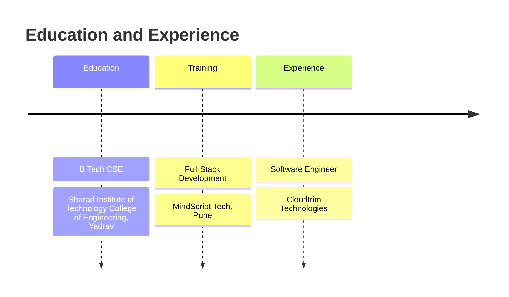

<!-- GitHub Profile README for Shivam Pisal | Repository: ShivamPisal -->

  

<h1 align="center">Hi, I'm Shivam Pisal</h1>

  

  
  
  
  
  
  

  
  
  

---

## About Me

- Software Engineer at **Cloudtrim Technologies**, Pune
- Full Stack Developer working with **Java, Spring Boot, React, MySQL, and AWS**
- Build and maintain **REST APIs**, responsive frontend components, and full-stack web applications
- Develop serverless applications using **AWS Lambda, API Gateway, DynamoDB, Cognito, SAM, S3, and Amplify**
- Use developer tools like **Git, Jira, Postman, Cursor, Codex, and Claude** to ship better software faster

---

## Tech Stack

  

<table>
  <tr>
    <td><strong>Backend</strong></td>
    <td>Java, Spring Boot, REST APIs, JPA</td>
  </tr>
  <tr>
    <td><strong>Frontend</strong></td>
    <td>React, JavaScript, HTML5, CSS3, responsive UI</td>
  </tr>
  <tr>
    <td><strong>Database</strong></td>
    <td>MySQL, schema design, SQL queries</td>
  </tr>
  <tr>
    <td><strong>Cloud & DevOps</strong></td>
    <td>AWS Lambda, API Gateway, DynamoDB, Cognito, S3, EC2, IAM, SAM, CloudFormation, Amplify</td>
  </tr>
  <tr>
    <td><strong>Tools</strong></td>
    <td>Git, GitHub, Jira, Postman, VS Code, Cursor, Codex, Claude</td>
  </tr>
</table>

---

## Cloud & DevOps

  
  
  
  
  
  
  
  
  
  
  

<table>
  <tr>
    <td><strong>Serverless Backend</strong></td>
    <td>AWS Lambda, API Gateway, DynamoDB, Cognito</td>
  </tr>
  <tr>
    <td><strong>Deployment & Infra</strong></td>
    <td>AWS SAM, CloudFormation, S3, Amplify, EC2, IAM</td>
  </tr>
  <tr>
    <td><strong>API Workflow</strong></td>
    <td>REST API design, Postman testing, debugging, validation, feature enhancements</td>
  </tr>
  <tr>
    <td><strong>Team Workflow</strong></td>
    <td>Git, Jira, Agile collaboration, code reviews, production-focused improvements</td>
  </tr>
</table>

---

## GitHub Analytics

  

  
  
  

  

  

---

## Contribution Snake

<!-- Generated by .github/workflows/snake.yml after GitHub Actions runs. -->

  <picture>
    <source media="(prefers-color-scheme: dark)" srcset="https://raw.githubusercontent.com/ShivamPisal/ShivamPisal/output/github-snake-dark.svg" />
    <source media="(prefers-color-scheme: light)" srcset="https://raw.githubusercontent.com/ShivamPisal/ShivamPisal/output/github-snake.svg" />
    
  </picture>

---

## LeetCode Activity

  

  

---

## Career Timeline

## Open to Collaborate

I'm open to collaborating on:

- Java and Spring Boot backend projects
- React frontend projects
- Full-stack web applications
- Beginner-friendly open-source contributions
- DSA, interview preparation, and project-based learning

---

## Connect With Me

  
  
  
  

## Random Dev Quote

  

<h3 align="center">Thanks for visiting. Let's build something useful.</h3>
