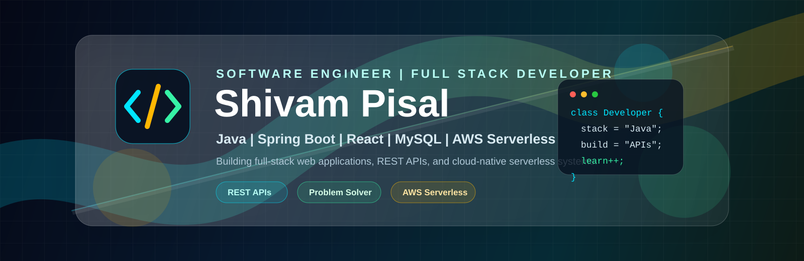
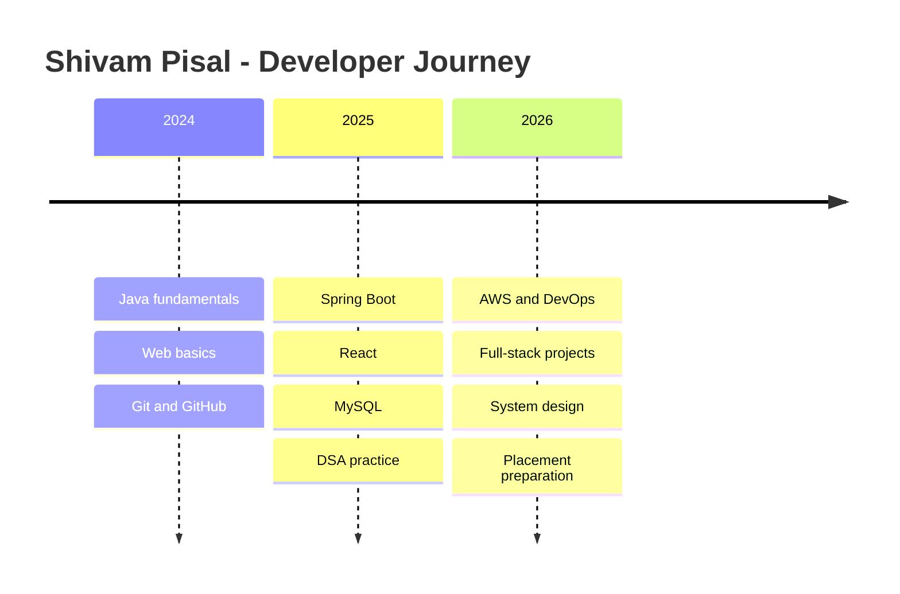

<<<<<<< HEAD
<!--
  GitHub Profile README for Shivam Pisal
  Tip: keep this repository name exactly the same as your GitHub username: ShivamPisal
-->

<p align="center">
  
</p>

<h1 align="center">Hi, I'm Shivam Pisal</h1>

<p align="center">
  <a href="https://readme-typing-svg.demolab.com">
    
=======
<h1 align="center">👋 Hello, I'm Shivam Pisal</h1>
<p align="center">
  
</p>


---

## 💡 About Me

🎓 I'm a Computer Science and Engineering student at **Sharad Institute of Technology, Yadrav**  
🔥 Learning full-stack development with **Java, Spring Boot, React**  
💪 Passionate about building real-world applications and solving problems  
📈 Currently improving DSA and backend skills for industry-level development  
🎯 Future goal: Become a software developer at a top product-based company  

---

## 🚀 Tech Stack

<p align="center">
  
</p>

---

## 🧠 Currently Working On

- 🔨 Spring Boot & React Projects
- 📘 DSA Practice on LeetCode
- 🖼️ Portfolio Website
- 🧪 Improving System Design & API Building

---

## 🏆 LeetCode Activity

<p align="center">
  <a href="https://leetcode.com/shivampisal00/" target="_blank">
    
>>>>>>> a49339842d39e55054b49868da591350bbc36c1a
  </a>
</p>

<p align="center">
<<<<<<< HEAD
  <a href="https://www.linkedin.com/in/shivam-pisal/"></a>
  <a href="mailto:shivampisal.866@gmail.com"></a>
  <a href="https://github.com/ShivamPisal"></a>
  <a href="https://leetcode.com/shivampisal00/"></a>
  <a href="https://www.instagram.com/shivampisal00/"></a>
</p>

<p align="center">
  
  
  
=======
  
>>>>>>> a49339842d39e55054b49868da591350bbc36c1a
</p>

---

<<<<<<< HEAD
## About Me


- Computer Science and Engineering student at **Sharad Institute of Technology, Yadrav**
- Focused on **Java, Spring Boot, React, MySQL, REST APIs, and AWS fundamentals**
- Building full-stack projects that solve real problems and improve developer discipline
- Practicing **DSA on LeetCode** and strengthening backend design skills
- Goal for 2026: become a confident software developer ready for product-based engineering teams

<br clear="right" />

---

## Tech Stack

<p align="center">
  
</p>

<table>
  <tr>
    <td><strong>Backend</strong></td>
    <td>Java, Spring Boot, REST APIs, Spring Security, JDBC/JPA basics</td>
  </tr>
  <tr>
    <td><strong>Frontend</strong></td>
    <td>React, JavaScript, HTML5, CSS3, responsive UI</td>
  </tr>
  <tr>
    <td><strong>Database</strong></td>
    <td>MySQL, schema design, SQL queries</td>
  </tr>
  <tr>
    <td><strong>Tools</strong></td>
    <td>Git, GitHub, VS Code, IntelliJ IDEA, Postman</td>
  </tr>
  <tr>
    <td><strong>Learning</strong></td>
    <td>AWS, Docker, CI/CD, system design, clean architecture</td>
  </tr>
</table>

---

## Cloud & DevOps

<p align="center">
  
  
  
  
  
  
</p>

```yaml
cloud_focus:
  aws: [EC2, S3, IAM, deployment basics]
  devops: [GitHub Actions, Docker fundamentals, CI/CD pipelines]
  backend_delivery: [API testing, environment config, production readiness]
```

---

## Featured Projects

<!-- Replace the repository names below with your best public repositories after pushing them. -->

<table>
  <tr>
    <td width="50%">
      <h3 align="center">Portfolio Website</h3>
      <p align="center">
        <a href="https://github.com/ShivamPisal">
          
        </a>
      </p>
      <p align="center">React portfolio with modern UI, smooth sections, and project highlights.</p>
    </td>
    <td width="50%">
      <h3 align="center">Spring Boot API</h3>
      <p align="center">
        <a href="https://github.com/ShivamPisal">
          
        </a>
      </p>
      <p align="center">REST API project focused on clean endpoints, validation, and database integration.</p>
    </td>
  </tr>
  <tr>
    <td width="50%">
      <h3 align="center">Full Stack App</h3>
      <p align="center">
        <a href="https://github.com/ShivamPisal">
          
        </a>
      </p>
      <p align="center">Spring Boot and React application with practical user workflows.</p>
    </td>
    <td width="50%">
      <h3 align="center">DSA Practice</h3>
      <p align="center">
        <a href="https://github.com/ShivamPisal">
          
        </a>
      </p>
      <p align="center">Structured Java solutions for arrays, strings, trees, graphs, and dynamic programming.</p>
    </td>
  </tr>
</table>

---

## GitHub Analytics

<p align="center">
  
  
</p>

<p align="center">
  
</p>

<p align="center">
  
</p>

<p align="center">
  
=======
## 📊 GitHub Stats

<p align="center">
  
  
</p>

<p align="center">
  
>>>>>>> a49339842d39e55054b49868da591350bbc36c1a
</p>

---

<<<<<<< HEAD
## Auto-Updating Metrics Dashboard

<!-- Generated by .github/workflows/metrics.yml after GitHub Actions runs. -->

<p align="center">
  
</p>

---

## LeetCode Activity

<p align="center">
  <a href="https://leetcode.com/shivampisal00/">
    
  </a>
</p>

<p align="center">
  
</p>

---

## Current Learning

<table>
  <tr>
    <td width="33%"><strong>Backend</strong><br />Spring Boot, API security, JPA, testing</td>
    <td width="33%"><strong>Frontend</strong><br />React patterns, clean UI, reusable components</td>
    <td width="33%"><strong>DSA</strong><br />Arrays, strings, trees, graphs, dynamic programming</td>
  </tr>
  <tr>
    <td width="33%"><strong>Cloud</strong><br />AWS EC2, S3, IAM, deployment workflows</td>
    <td width="33%"><strong>DevOps</strong><br />GitHub Actions, Docker, CI/CD basics</td>
    <td width="33%"><strong>System Design</strong><br />Scalable APIs, caching, database design</td>
  </tr>
</table>

---

## 2026 Goals

- Build and publish **5+ production-quality full-stack projects**
- Solve **400+ DSA problems** with strong revision notes
- Learn **AWS deployment and CI/CD** through real project hosting
- Contribute to open-source projects and improve collaboration skills
- Prepare for software developer roles at strong product-based companies

---

## Career Timeline



---

## Contribution Snake

<!-- Generated by .github/workflows/snake.yml after GitHub Actions runs. -->

<p align="center">
  <picture>
    <source media="(prefers-color-scheme: dark)" srcset="https://raw.githubusercontent.com/ShivamPisal/ShivamPisal/output/github-snake-dark.svg" />
    <source media="(prefers-color-scheme: light)" srcset="https://raw.githubusercontent.com/ShivamPisal/ShivamPisal/output/github-snake.svg" />
    
  </picture>
</p>

---

## Open to Collaborate

I'm open to collaborating on:

- Java and Spring Boot backend projects
- React frontend projects
- Full-stack web applications
- Beginner-friendly open-source contributions
- DSA, interview preparation, and project-based learning

---

## Connect With Me

<p align="center">
  <a href="https://www.linkedin.com/in/shivam-pisal/"></a>
  <a href="mailto:shivampisal.866@gmail.com"></a>
  <a href="https://leetcode.com/shivampisal00/"></a>
</p>

---

## Random Dev Quote

<p align="center">
  
</p>

<h3 align="center">Thanks for visiting. Let's build something useful.</h3>
=======
## 🌐 Connect with Me

<p align="center">
  <a href="https://www.linkedin.com/in/shivam-pisal/" target="_blank">
    
  </a>
  <a href="https://www.instagram.com/shivampisal00/" target="_blank">
    
  </a>
  <a href="mailto:shivampisal.866@gmail.com" target="_blank">
    
  </a>
  <a href="https://github.com/shivampisal" target="_blank">
    
  </a>
  <a href="https://leetcode.com/shivampisal00/" target="_blank">
    
  </a>
</p>

---


## 💬 Fun Quote

<p align="center">
  <b><i>"I’m not lazy. I’m just on energy‑saving mode." ⚡😴</i></b>
</p>


>>>>>>> a49339842d39e55054b49868da591350bbc36c1a
